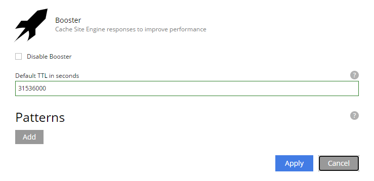

= Configuration

== Global Configuration file

`com.enonic.app.booster.cfg` is the configuration file for the application. It includes the following properties:

- `cacheTtl`: Default time-to-live (TTL) for the cache is seconds. The default value is 3600 seconds (1 hour).
- `cacheSize`: Total number of items in the cache. The default value is 10000.
- `appsForceInvalidateOnInstall`: Comma-separated list of applications that should invalidate the cache on their installation. By default, no applications are listed.
- `excludeQueryParamsPreset`: Comma-separated list of query parameters that should be excluded from the cache key. The default value provides a list of common query parameters that should be excluded from the cache key (e.g. `utm_source`, `gclid`, `fbclid`, ...)
- `excludeQueryParams`: Comma-separated list of query parameters that should be excluded from the cache key. Allows to add extra query parameters to exclude from the cache key without need to change default `excludeQueryParamsPreset`. By default, no extra query parameters are listed.
- `disableCacheStatusHeader`: If set to `true` `Cache-Status` header is not sent in the response. The default value is `false`.
- `overrideHeaders`: Comma-separated list of instructions that override headers. By default, no instructions are listed.
- `cacheMimeTypes`: Comma-separated list of MIME types that should be cached. The default value is `text/html, text/xhtml`.

=== Control downstream cache

Different CDN and proxy servers can cache the response. Booster application can help to control the downstream cache by using `overrideHeaders` configuration property allows to override response headers. The property is a comma-separated list of instructions that override headers. Each instruction is a key-value pair separated by a colon. The key is the header name and the value is the header value. The header value can contain placeholders that are replaced with the actual value from the original response.

Disable caching in the downstream cache (CDN and browser):
[source,properties]
----
overrideHeaders="Cache-Control: private, no-store"
----

Disable cache in Fastly CDN but leave browser caching instruction as is:
[source,properties]
----
overrideHeaders="Surrogate-Control: private"
----

Disable cache in Cloudflare CDN but leave browser caching instruction as is:
[source,properties]
----
overrideHeaders="Cloudflare-CDN-Cache-Control: private"
----

Allow Fastly CDN to cache the response for 24 hours, but browser should cache the response for 1 minute:
[source,properties]
----
overrideHeaders="Surrogate-Control: max-age=86400","Cache-Control: max-age=60"
----

=== MIME Types

By default, Booster application caches only `text/html` and `text/xhtml` MIME types. The `cacheMimeTypes` configuration property is a comma-separated list of MIME types that should be cached.

Allow caching of `text/plain` (such as robots.txt), `text/xml` (such as sitemap.xml) and application/manifest+json (manifest.json) MIME types:
[source,properties]
----
cacheMimeTypes=text/html, text/xhtml, text/plain, text/xml, application/manifest+json
----

NOTE: Booster does not cache responses with `Vary` header, including but not limited to `Vary: Accept`.

=== Query Parameters

By default, Booster application considers query parameters when generating the cache key. However, some query parameters are not relevant to the cache key and should be excluded. The `excludeQueryParams` configuration property is a comma-separated list of query parameters that should be excluded from the cache key. The default value provides a list of common query parameters that should be excluded from the cache key (e.g. `utm_source`, `gclid`, `fbclid`, ...). If you want to keep the default list and add extra query parameters to exclude from the cache key, you can use the `excludeQueryParamsExtra` configuration property.

== Application Configuration

=== Exclude Paths

By default, when Booster application is installed on a Site, it caches all paths. However, there are cases when some paths should not be cached. The `Disabled` site configuration allows to disable caching for the entire Site. The `Patterns` site configuration property allows to cache only specific paths.

If no patterns are provided, all paths are cached. Otherwise, at least one pattern should match the request path for the request to be cached.

A pattern is a regular expression that is used to match the request path.
A pattern element may also contain an `invert` attribute to indicate that the result of evaluating the regular expression should be negated.

The syntax of the pattern is the same as https://developer.enonic.com/docs/xp/stable/framework/mappings#pattern_mappings[XP Framework pattern mappings].

=== Default TTL

Default TTL setting allows to specify cache TTL for controller responses without max-age or s-max-age headers.
By default, the value is not set and the cache TTL is determined by the `cacheTtl` configuration property.
