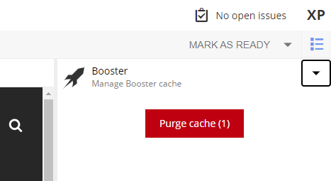

== Installation

Booster application is available in https://market.enonic.com/applications[Enonic Market].

To install it, open the Applications XP tool and click on the `Install` button. Then select "Booster" from the list.

Ones installed, the application is available in the list of site applications. You can install it on a site to cache the site's content.

=== License

A license is required to use this application. Once installed, application is capable to cache responses.

You can https://enonic.com/contact-us[contact Enonic] to request a license.
The license can be installed in Content Studio widget.

== Content Studio Widget

The widget is available in the Content Studio. It allows to invalidate the cache for the entire project.

