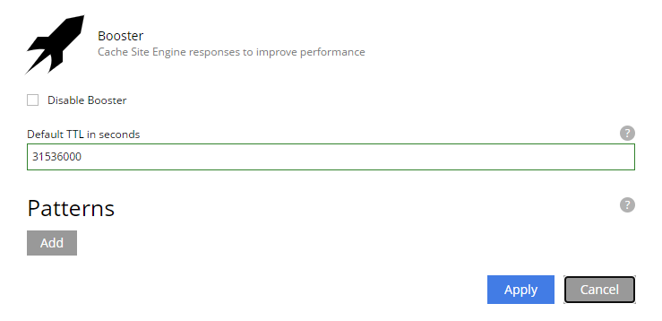
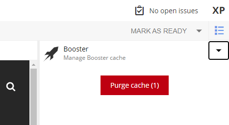

= Usage

How to install and enable Booster on your site

== 1. Install

Booster is available on https://market.enonic.com/vendors/enonic/booster[Enonic Market].

Install via `XP menu` -> `Applications` -> `Install` button, or via the Cloud Console.

== 2. Add to site

Next, edit the site where you wish to activate Booster, and add Booster to the list of site applications.

Optionally configure the application by setting Time To Live and exclude patterns

NOTE: Remember to publish the site after adding Booster for changes to take effect.

== 3. Add License

Unlike most Enonic apps, Booster requires a valid Enonic subscription to work. In Content Studio, open the `Booster` context panel and upload your license file - if it was not already installed.

NOTE: https://www.enonic.com/company/contact-us[Contact us] for a trial license, or for activating a subscription.

== 4. Verify

With a licensed version of Booster deployed to your site, it is time to verify that it is working properly.

Beyond experiencing much faster pages, the best way of validating that Booster is working proerly is by looking at the HTTP response headers (using your browser's dev tools, or by using cURL commandline utility)

You should see the `Cache-Status` header, and it should contain `Booster;` as one of its values.

For more details, visit the <<how-it-works#, How it works chapter>>

== 5. Cache Invalidation

Booster will automatically invalidate cache for common scenarios like publishing and changes to applications, there are however two other ways you may clear the cache:

=== Manually

Clear cache for an entire content project by using the `Booster` context panel, available in Content Studio.

NOTE: One of the roles `CMS Admin`, `Project Owner` or `System Admin` is required to access to this widget.

TIP: You may verify that the cache was cleared by checking the `Cache-Status` header.

=== Programmatically

Sometimes you may wish to clear the Booster cache based on other changes. This can be done by invoking the Booster API tasks `invalidate` or `purge-all`.

Visit the <<api#, API chapter>> for more details.

