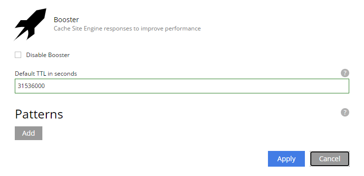

= Usage

== Cache Invalidation

=== Automatic Cache Invalidation

The cache is automatically invalidated when the following events occur:
- Application listed in `appsInvalidateCacheOnStart` starts. The entire cache is invalidated.
- Content is published/unpublished. The cache is invalidated for the published Content's Project.
- Content scheduled for publishing/unpublishing reaches its scheduled time. The cache invalidated for the scheduled Content's Project.
- Project deleted. The cache invalidated for the deleted Project.
- Cache item expired meaning Time to live (TTL) for the cache item is reached.

=== Manual Cache Invalidation

The cache can be manually invalidated in Content Studio widget. Only entire project cache can be invalidated.
Only Project Owners and System Administrators have access to the widget.

=== Programmatic Cache Invalidation

There are two tasks that can be used to invalidate the cache programmatically:
- `com.enonic.app.booster:invalidate`
- `com.enonic.app.booster:purge-all`

== Query Parameters

By default, Booster application considers query parameters when generating the cache key. However, some query parameters are not relevant to the cache key and should be excluded. The `excludeQueryParams` configuration property is a comma-separated list of query parameters that should be excluded from the cache key. The default value provides a list of common query parameters that should be excluded from the cache key (e.g. `utm_source`, `gclid`, `fbclid`, ...). If you want to keep the default list and add extra query parameters to exclude from the cache key, you can use the `excludeQueryParamsExtra` configuration property.

== Exclude Paths

By default, when Booster application is installed on a Site, it caches all paths. However, there are cases when some paths should not be cached. The `Disabled` site configuration allows to disable caching for the entire Site. The `Patterns` site configuration property allows to cache only specific paths.

If no patterns are provided, all paths are cached. Otherwise, at least one pattern should match the request path for the request to be cached.

A pattern is a regular expression that is used to match the request path.
A pattern element may also contain an `invert` attribute to indicate that the result of evaluating the regular expression should be negated.

The syntax of the pattern is the same as https://developer.enonic.com/docs/xp/stable/framework/mappings#pattern_mappings[XP Framework pattern mappings].

